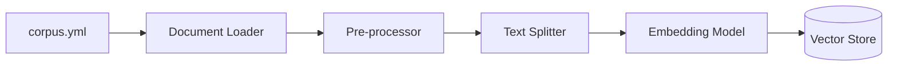
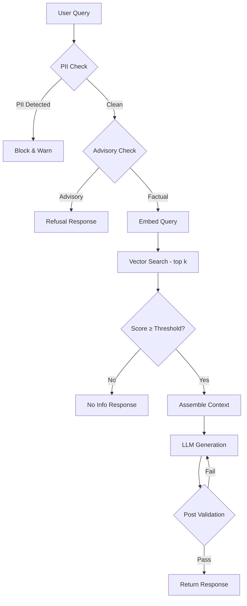

# Architecture — RAG Mutual Fund FAQ Assistant

> **Version**: 1.0  
> **Last Updated**: 2026-08-02  
> **Status**: Draft  
> **Derived From**: [context.md](./context.md) · [problemStatement.txt](./problemStatement.txt)

---

## Table of Contents

1. [System Overview](#1-system-overview)
2. [High-Level Architecture](#2-high-level-architecture)
3. [Component Deep Dive](#3-component-deep-dive)
4. [Data Pipeline Architecture](#4-data-pipeline-architecture)
5. [Scheduler — Automated Ingestion (GitHub Actions)](#5-scheduler--automated-ingestion-github-actions)
6. [Retrieval Strategy](#6-retrieval-strategy)
7. [Generation & Response Pipeline](#7-generation--response-pipeline)
8. [Guardrails & Refusal Engine](#8-guardrails--refusal-engine)
9. [API & Interface Layer](#9-api--interface-layer)
10. [Data Flow — End-to-End](#10-data-flow--end-to-end)
11. [Technology Stack (Recommended)](#11-technology-stack-recommended)
12. [Directory Structure](#12-directory-structure)
13. [Security & Privacy Architecture](#13-security--privacy-architecture)
14. [Configuration & Environment](#14-configuration--environment)
15. [Deployment Architecture](#15-deployment-architecture)
16. [Observability & Monitoring](#16-observability--monitoring)
17. [Failure Modes & Fallbacks](#17-failure-modes--fallbacks)
18. [Scalability Considerations](#18-scalability-considerations)
19. [Architecture Decision Records (ADRs)](#19-architecture-decision-records-adrs)

---

## 1. System Overview

The RAG Mutual Fund FAQ Assistant is a **facts-only question-answering system** that retrieves verified information from a curated corpus of official mutual fund documents and generates concise, source-cited responses. The system is built on a **Retrieval-Augmented Generation (RAG)** architecture, combining vector-based semantic search with LLM-powered answer synthesis.

### 1.1 Design Principles

| # | Principle | Implication |
|---|-----------|-------------|
| 1 | **Accuracy over intelligence** | Prefer retrieval-backed facts over creative generation |
| 2 | **Transparency** | Every claim is traceable to an official public source |
| 3 | **Compliance** | Zero financial advice — aligned with SEBI/AMFI guidelines |
| 4 | **Simplicity** | Minimal UI, concise responses, no feature bloat |
| 5 | **Privacy-first** | No PII collection or storage, ever |

### 1.2 System Boundaries

```
┌─────────────────────────────────────────────────────────────┐
│                      IN SCOPE                               │
│  • Factual Q&A on mutual fund schemes (HDFC AMC, 12 schemes)│
│  • Source-cited answers (≤ 3 sentences)                     │
│  • Polite refusal of advisory queries                       │
│  • Minimal chat-based UI                                    │
├─────────────────────────────────────────────────────────────┤
│                     OUT OF SCOPE                            │
│  • Investment advice / recommendations                      │
│  • Performance comparisons / return calculations             │
│  • Multi-AMC aggregation                                    │
│  • User authentication / account management                 │
│  • PII collection or storage                                │
└─────────────────────────────────────────────────────────────┘
```

---

## 2. High-Level Architecture

```
                         ┌──────────────────────────────────────────────┐
                         │              CLIENT LAYER                    │
                         │  ┌────────────────────────────────────────┐  │
                         │  │        Chat UI (Web Interface)         │  │
                         │  │  • Welcome message & disclaimer        │  │
                         │  │  • 3 clickable example questions        │  │
                         │  │  • Text input + response area          │  │
                         │  └──────────────────┬─────────────────────┘  │
                         └─────────────────────┼───────────────────────┘
                                               │ HTTP / WebSocket
                                               ▼
                         ┌──────────────────────────────────────────────┐
                         │              API GATEWAY LAYER               │
                         │  ┌────────────────────────────────────────┐  │
                         │  │      REST / FastAPI Application        │  │
                         │  │  • Request validation                  │  │
                         │  │  • PII detection & rejection           │  │
                         │  │  • Rate limiting                       │  │
                         │  └──────────────────┬─────────────────────┘  │
                         └─────────────────────┼───────────────────────┘
                                               │
                                               ▼
┌───────────────────────────────────────────────────────────────────────────────┐
│                              CORE RAG ENGINE                                  │
│                                                                               │
│  ┌─────────────┐    ┌─────────────────┐    ┌──────────────────────────────┐  │
│  │  Guardrails  │───▶│    Retriever     │───▶│       Generator (LLM)        │  │
│  │  & Refusal   │    │  (Vector Search) │    │  • Context-grounded answer   │  │
│  │  Engine      │    │  • Top-k chunks  │    │  • ≤ 3 sentences             │  │
│  │              │    │  • Re-ranking     │    │  • Citation + date footer    │  │
│  └─────────────┘    └────────┬──────────┘    └──────────────────────────────┘  │
│                              │                                                │
│                              ▼                                                │
│                    ┌──────────────────┐                                        │
│                    │   Vector Store    │                                        │
│                    │  (Embeddings DB)  │                                        │
│                    └──────────────────┘                                        │
│                                                                               │
└───────────────────────────────────────────────────────────────────────────────┘
                                               │
                                               ▼
                         ┌──────────────────────────────────────────────┐
                         │            DATA PIPELINE LAYER               │
                         │  ┌──────┐  ┌────────┐  ┌──────────────────┐ │
                         │  │Loader│─▶│Chunker │─▶│ Embedding Model  │ │
                         │  └──────┘  └────────┘  └──────────────────┘ │
                         │       ▲                                      │
                         │       │                                      │
                         │  ┌────────────────────┐                      │
                         │  │ Official Sources    │                      │
                         │  │ (AMC / AMFI / SEBI) │                      │
                         │  └────────────────────┘                      │
                         └──────────────────────────────────────────────┘
```

---

## 3. Component Deep Dive

### 3.1 Document Loader

| Attribute | Detail |
|-----------|--------|
| **Purpose** | Fetch and parse content from official URLs and PDF documents |
| **Input** | Curated list of official public URLs (12 Groww scheme pages) / PDF file paths |
| **Output** | Raw text with source metadata (URL, title, fetch date) |
| **Supported Formats** | HTML pages, PDF documents |

**Responsibilities:**

- Fetch HTML content from AMC, AMFI, and SEBI web pages
- Extract text from PDF documents (factsheets, KIMs, SIDs)
- Attach metadata to each document: `source_url`, `document_type`, `fetch_date`, `scheme_name`
- Handle encoding, malformed HTML, and multi-page PDFs gracefully
- Log fetch failures without crashing the pipeline

**Design Considerations:**

- Use a URL whitelist — only `groww.in`, `hdfcfund.com`, `amfiindia.com`, and `sebi.gov.in` domains are permitted
- Store raw fetched content alongside parsed output for audit trails
- Implement retry logic with exponential backoff for transient network failures

---

### 3.2 Text Splitter / Chunker

| Attribute | Detail |
|-----------|--------|
| **Purpose** | Break documents into semantically coherent, retrieval-friendly chunks |
| **Input** | Raw parsed text with metadata |
| **Output** | List of text chunks with inherited metadata + chunk index |

**Chunking Strategy:**

```
┌──────────────────────────────────────────────────────┐
│                    Raw Document                       │
│                                                      │
│  Section 1: Fund Overview                            │
│  ├── Chunk 1.1 (≤ 500 tokens, 100-token overlap)    │
│  └── Chunk 1.2 (≤ 500 tokens, 100-token overlap)    │
│                                                      │
│  Section 2: Expense Details                          │
│  ├── Chunk 2.1                                       │
│  └── Chunk 2.2                                       │
│                                                      │
│  Table: Key Facts                                    │
│  └── Chunk 3.1 (table preserved as single chunk)     │
└──────────────────────────────────────────────────────┘
```

**Rules:**

- **Chunk size**: ~500 tokens with ~100 token overlap
- **Section-aware splitting**: Prefer splitting at headings and paragraph boundaries
- **Table preservation**: Keep tabular data (expense ratios, exit loads) intact within a single chunk
- **Metadata inheritance**: Each chunk carries the parent document's `source_url`, `document_type`, `scheme_name`, and `fetch_date`

---

### 3.3 Embedding Model

| Attribute | Detail |
|-----------|--------|
| **Purpose** | Convert text chunks into dense vector representations |
| **Input** | Text chunks (strings) |
| **Output** | Fixed-dimension embedding vectors |
| **Model** | `BAAI/bge-small-en-v1.5` (default) or `BAAI/bge-large-en-v1.5` (higher accuracy) |
| **Dimensions** | 384 (bge-small) / 1024 (bge-large) |
| **Runtime** | Local via HuggingFace `sentence-transformers` — **no API key required** |

> **Why BGE?** BGE (BAAI General Embedding) models are open-source, top-ranked on the MTEB leaderboard, and run locally — eliminating external API costs and latency for embeddings. Use `bge-small` for fast prototyping and `bge-large` for production-grade retrieval quality.

**Design Considerations:**

- Use `bge-small-en-v1.5` during development (faster, lower memory); switch to `bge-large-en-v1.5` for production if retrieval quality needs improvement
- Prefix queries with `"Represent this sentence for searching relevant passages: "` as recommended by the BGE authors for optimal retrieval
- Batch embedding calls to optimise throughput during ingestion
- Normalise vectors for cosine similarity search

---

### 3.4 Vector Store

| Attribute | Detail |
|-----------|--------|
| **Purpose** | Store and index embeddings for fast similarity-based retrieval |
| **Store** | ChromaDB (local + production) |
| **Index Type** | HNSW (Hierarchical Navigable Small World) for approximate nearest neighbour search |

**Schema (per record):**

```json
{
  "id": "chunk_<doc_id>_<chunk_index>",
  "embedding": [0.023, -0.117, ...],
  "metadata": {
    "source_url": "https://groww.in/mutual-funds/hdfc-small-cap-fund-direct-growth",
    "document_type": "scheme_page",
    "scheme_name": "HDFC Small Cap Fund - Direct Growth",
    "fetch_date": "2026-07-15",
    "chunk_index": 2,
    "chunk_text": "The expense ratio of HDFC Small Cap Fund..."
  }
}
```

**Operational Notes:**

- Use a single collection/namespace per corpus version for easy rollback
- Persist the vector store to disk to avoid re-embedding on restart
- Support metadata filtering (e.g., filter by `scheme_name` or `document_type`) during retrieval

---

### 3.5 Retriever

| Attribute | Detail |
|-----------|--------|
| **Purpose** | Given a user query, retrieve the top-k most relevant chunks |
| **Retrieval Method** | Embedding-based semantic similarity (cosine distance) |
| **Top-k** | Default `k = 5` (configurable) |

**Retrieval Pipeline:**

```
User Query
    │
    ▼
┌──────────────────┐
│  Embed Query      │  ← Same embedding model as ingestion
└────────┬─────────┘
         │
         ▼
┌──────────────────┐
│  Vector Search    │  ← Cosine similarity, top-k = 5
└────────┬─────────┘
         │
         ▼
┌──────────────────┐
│  (Optional)       │
│  Re-Ranker        │  ← Cross-encoder re-ranking for precision
└────────┬─────────┘
         │
         ▼
┌──────────────────┐
│  Retrieved Chunks │  ← With metadata (source_url, date, etc.)
└──────────────────┘
```

**Enhancement Options:**

- **Metadata pre-filtering**: If the query mentions a specific scheme, filter by `scheme_name` before vector search
- **Hybrid search**: Combine vector similarity with keyword (BM25) search for better recall on exact terms like fund names or ISIN codes
- **Re-ranking**: Apply a cross-encoder model to re-rank the top-k results for improved precision

---

### 3.6 Generator (LLM)

| Attribute | Detail |
|-----------|--------|
| **Purpose** | Synthesise a concise, factual answer from retrieved context |
| **Provider** | **Groq** (ultra-low-latency inference cloud) |
| **Model** | `llama-3.1-8b-instant` (default) or `mixtral-8x7b-32768` (complex queries) |
| **Temperature** | `0.0` – `0.2` (deterministic, factual output) |
| **Max Output Tokens** | ~150 (to enforce ≤ 3 sentences) |

> **Why Groq?** Groq's LPU (Language Processing Unit) provides sub-second inference latency for open-source models at a fraction of the cost of proprietary LLM APIs. The generous free tier is ideal for MVP development.

**System Prompt (Condensed):**

```
You are a facts-only mutual fund FAQ assistant. You answer ONLY using the
provided context. You MUST:
  1. Respond in ≤ 3 sentences using only information from the context.
  2. Include exactly 1 source citation URL from the context metadata.
  3. End with: "Last updated from sources: <date>"
  4. REFUSE any advisory, comparative, or speculative questions politely.
  5. NEVER provide investment advice, performance comparisons, or opinions.
  6. If the context does not contain the answer, say so honestly.
```

**Prompt Template:**

```
CONTEXT:
{retrieved_chunks}

SOURCE METADATA:
{chunk_metadata_with_urls_and_dates}

USER QUESTION:
{user_query}

INSTRUCTIONS:
Answer the question using ONLY the context above. Follow the response
format: ≤ 3 factual sentences, 1 source link, and a "Last updated" footer.
If the question is advisory or out of scope, refuse politely.
```

---

### 3.7 Guardrails & Refusal Engine

This component acts as a **pre-generation and post-generation safety layer**.

#### Pre-Generation Guardrails (before retrieval)

```
User Query
    │
    ▼
┌──────────────────────────────────────┐
│         GUARDRAIL CHECKS              │
│                                      │
│  1. PII Detection                    │
│     • Regex: PAN, Aadhaar, phone,    │
│       email, bank account patterns   │
│     → Block & warn if detected       │
│                                      │
│  2. Advisory Intent Classification   │
│     • Keyword match: "should I",     │
│       "recommend", "better", "best", │
│       "will it give", "buy", "sell"  │
│     • (Optional) Classifier model    │
│     → Route to refusal handler       │
│                                      │
│  3. Out-of-Scope Detection           │
│     • Topic drift (non-MF queries)   │
│     → Route to refusal handler       │
└──────────────┬───────────────────────┘
               │
               ▼
        Pass → Retriever
        Fail → Refusal Response
```

#### Post-Generation Guardrails (after LLM output)

| Check | Action |
|-------|--------|
| Response contains advisory language | Strip or regenerate |
| Missing citation | Inject from retrieved chunk metadata |
| Missing "Last updated" footer | Append from chunk `fetch_date` |
| Response exceeds 3 sentences | Truncate or regenerate |
| Response contains PII patterns | Block and return error |

---

## 4. Data Pipeline Architecture

The data pipeline is an **offline batch process** that ingests official documents and prepares the vector store for retrieval.

```
┌───────────────────────────────────────────────────────────────────────┐
│                       DATA INGESTION PIPELINE                         │
│                                                                       │
│  ┌─────────────┐     ┌──────────────┐     ┌────────────────────────┐ │
│  │  URL / PDF   │────▶│  Document     │────▶│   Pre-processing       │ │
│  │  Registry    │     │  Loader       │     │   • Clean HTML/PDF     │ │
│  │  (corpus.yml)│     │              │     │   • Strip boilerplate  │ │
│  └─────────────┘     └──────────────┘     │   • Normalise text     │ │
│                                           └──────────┬─────────────┘ │
│                                                      │               │
│                                                      ▼               │
│  ┌────────────────────────┐     ┌────────────────────────────────┐   │
│  │   Metadata Enrichment   │◀────│   Text Splitter / Chunker      │   │
│  │   • source_url          │     │   • Section-aware splitting    │   │
│  │   • scheme_name         │     │   • ~500 tokens, 100 overlap   │   │
│  │   • document_type       │     │   • Table preservation         │   │
│  │   • fetch_date          │     └────────────────────────────────┘   │
│  └──────────┬─────────────┘                                          │
│             │                                                        │
│             ▼                                                        │
│  ┌────────────────────────┐     ┌────────────────────────────────┐   │
│  │   Embedding Model       │────▶│   Vector Store (ChromaDB)      │   │
│  │   • Batch embed chunks  │     │   • Persist to disk            │   │
│  │   • Normalise vectors   │     │   • HNSW index                 │   │
│  └────────────────────────┘     └────────────────────────────────┘   │
│                                                                       │
└───────────────────────────────────────────────────────────────────────┘
```

### 4.1 Corpus Registry (`corpus.yml`)

A configuration file that declares all approved sources:

```yaml
amc: "HDFC Mutual Fund"
schemes:
  - name: "HDFC Small Cap Fund - Direct Growth"
    category: "Small-Cap"
  - name: "HDFC Gold ETF Fund of Fund - Direct Plan Growth"
    category: "Gold / FoF"
  - name: "HDFC Multi Cap Fund - Direct Growth"
    category: "Multi-Cap"
  - name: "HDFC Large Cap Fund - Direct Growth"
    category: "Large-Cap"
  - name: "HDFC Mid Cap Fund - Direct Growth"
    category: "Mid-Cap"
  - name: "HDFC BSE Sensex Index Fund - Direct Growth"
    category: "Index"
  - name: "HDFC Short Term Opportunities Fund - Direct Growth"
    category: "Debt / Short Duration"
  - name: "HDFC Focused Fund - Direct Growth"
    category: "Focused"
  - name: "HDFC Nifty Next 50 Index Fund - Direct Growth"
    category: "Index"
  - name: "HDFC Pharma and Healthcare Fund - Direct Growth"
    category: "Sectoral / Thematic"
  - name: "HDFC Balanced Advantage Fund - Direct Growth"
    category: "Hybrid / Dynamic Asset Allocation"
  - name: "HDFC Defence Fund - Direct Growth"
    category: "Sectoral / Thematic"

sources:
  - url: "https://groww.in/mutual-funds/hdfc-small-cap-fund-direct-growth"
    type: "scheme_page"
    scheme: "HDFC Small Cap Fund - Direct Growth"
  - url: "https://groww.in/mutual-funds/hdfc-gold-etf-fund-of-fund-direct-plan-growth"
    type: "scheme_page"
    scheme: "HDFC Gold ETF Fund of Fund - Direct Plan Growth"
  - url: "https://groww.in/mutual-funds/hdfc-multi-cap-fund-direct-growth"
    type: "scheme_page"
    scheme: "HDFC Multi Cap Fund - Direct Growth"
  - url: "https://groww.in/mutual-funds/hdfc-large-cap-fund-direct-growth"
    type: "scheme_page"
    scheme: "HDFC Large Cap Fund - Direct Growth"
  - url: "https://groww.in/mutual-funds/hdfc-mid-cap-fund-direct-growth"
    type: "scheme_page"
    scheme: "HDFC Mid Cap Fund - Direct Growth"
  - url: "https://groww.in/mutual-funds/hdfc-bse-sensex-index-fund-direct-growth"
    type: "scheme_page"
    scheme: "HDFC BSE Sensex Index Fund - Direct Growth"
  - url: "https://groww.in/mutual-funds/hdfc-short-term-opportunities-fund-direct-growth"
    type: "scheme_page"
    scheme: "HDFC Short Term Opportunities Fund - Direct Growth"
  - url: "https://groww.in/mutual-funds/hdfc-focused-fund-direct-growth"
    type: "scheme_page"
    scheme: "HDFC Focused Fund - Direct Growth"
  - url: "https://groww.in/mutual-funds/hdfc-nifty-next-50-index-fund-direct-growth"
    type: "scheme_page"
    scheme: "HDFC Nifty Next 50 Index Fund - Direct Growth"
  - url: "https://groww.in/mutual-funds/hdfc-pharma-and-healthcare-fund-direct-growth"
    type: "scheme_page"
    scheme: "HDFC Pharma and Healthcare Fund - Direct Growth"
  - url: "https://groww.in/mutual-funds/hdfc-balanced-advantage-fund-direct-growth"
    type: "scheme_page"
    scheme: "HDFC Balanced Advantage Fund - Direct Growth"
  - url: "https://groww.in/mutual-funds/hdfc-defence-fund-direct-growth"
    type: "scheme_page"
    scheme: "HDFC Defence Fund - Direct Growth"
```

### 4.2 Re-Ingestion Strategy

| Trigger | Action | How |
|---------|--------|-----|
| **Weekday scheduled refresh** | Re-fetch all sources, re-chunk, re-embed | GitHub Actions cron (10:30 AM IST, Mon–Sat, skips holidays) — see [Section 5](#5-scheduler--automated-ingestion-github-actions) |
| Monthly factsheet update | Covered by the weekday schedule; new factsheet data is picked up automatically | Scheduler |
| New scheme added | Add to `corpus.yml`, next scheduled run ingests it | Manual commit → auto-ingestion |
| Source URL changed | Update `corpus.yml`, next scheduled run re-ingests | Manual commit → auto-ingestion |
| Schema/model change | Full re-ingestion of all sources | Manual workflow dispatch |

---

## 5. Scheduler — Automated Ingestion (GitHub Actions)

The Scheduler is a **GitHub Actions workflow** that triggers the data ingestion pipeline on **weekdays (Monday–Saturday) at 10:30 AM IST (05:00 UTC)**, skipping Sundays and Indian market/national holidays. This ensures the vector store stays current with official sources while avoiding wasteful runs on non-business days.

### 5.1 Why a Scheduler?

- Official factsheets and scheme documents are updated on business days; no updates occur on Sundays or market holidays
- A weekday-only automated run ensures stale data is detected and refreshed without manual intervention
- Skipping Sundays and holidays saves GitHub Actions minutes and avoids unnecessary commits
- GitHub Actions provides a zero-infrastructure, version-controlled CI/CD solution that lives alongside the codebase

### 5.2 Architecture

```
┌─────────────────────────────────────────────────────────────────────────┐
│                     GITHUB ACTIONS SCHEDULER                            │
│                                                                         │
│  ┌─────────────────────────────────────────────────────────────────┐    │
│  │  Trigger: cron  '0 5 * * 1-6'  (Mon–Sat, 05:00 UTC = 10:30 IST)│   │
│  │           + holiday skip check + manual dispatch                 │    │
│  └──────────────────────┬──────────────────────────────────────────┘    │
│                         │                                               │
│                         ▼                                               │
│  ┌──────────────────────────────────────────────────────────────┐       │
│  │  Job: ingest                                                 │       │
│  │                                                              │       │
│  │  Step 1: Checkout repository                                 │       │
│  │  Step 2: Set up Python 3.11+                                 │       │
│  │  Step 3: Install dependencies (requirements.txt)             │       │
│  │  Step 4: Run ingestion script (python scripts/ingest.py)     │       │
│  │  Step 5: Commit & push updated vector store (if changed)     │       │
│  │  Step 6: Post-ingestion health check                         │       │
│  └──────────────────────┬───────────────────────────────────────┘       │
│                         │                                               │
│                         ▼                                               │
│  ┌──────────────────────────────────────────────────────────────┐       │
│  │  On Failure: Notify via GitHub Issues / Slack webhook         │       │
│  └──────────────────────────────────────────────────────────────┘       │
│                                                                         │
└─────────────────────────────────────────────────────────────────────────┘
```

### 5.3 Workflow Definition

File: `.github/workflows/weekday-ingest.yml`

```yaml
name: Weekday Corpus Ingestion

on:
  schedule:
    # 05:00 UTC = 10:30 AM IST, Monday(1) through Saturday(6)
    # Sundays are excluded by cron; holidays are skipped in-job
    - cron: '0 5 * * 1-6'
  workflow_dispatch:          # Allow manual trigger from GitHub UI
    inputs:
      full_reindex:
        description: 'Force full re-ingestion (ignore cache)'
        required: false
        default: 'false'
        type: boolean
      skip_holiday_check:
        description: 'Run even if today is a holiday'
        required: false
        default: 'false'
        type: boolean

env:
  PYTHON_VERSION: '3.11'

jobs:
  check-holiday:
    name: Check if today is a holiday
    runs-on: ubuntu-latest
    outputs:
      is_holiday: ${{ steps.holiday.outputs.is_holiday }}
    steps:
      - name: Checkout repository
        uses: actions/checkout@v4

      - name: Check Indian holidays
        id: holiday
        run: |
          TODAY=$(TZ='Asia/Kolkata' date '+%Y-%m-%d')
          echo "Checking date: $TODAY"

          # Indian national & market holidays for the current year
          # Maintained in data/holidays.json — a flat array of "YYYY-MM-DD" strings
          if [ -f data/holidays.json ]; then
            IS_HOLIDAY=$(python3 -c "
import json, sys
with open('data/holidays.json') as f:
    holidays = json.load(f)
print('true' if '$TODAY' in holidays else 'false')
")
          else
            echo "⚠️ holidays.json not found — assuming business day"
            IS_HOLIDAY="false"
          fi

          # Allow manual override
          if [ "${{ github.event.inputs.skip_holiday_check }}" = "true" ]; then
            IS_HOLIDAY="false"
            echo "Holiday check overridden by manual dispatch"
          fi

          echo "is_holiday=$IS_HOLIDAY" >> "$GITHUB_OUTPUT"
          echo "Is holiday: $IS_HOLIDAY"

  ingest:
    name: Ingest Corpus & Update Vector Store
    needs: check-holiday
    if: needs.check-holiday.outputs.is_holiday == 'false'
    runs-on: ubuntu-latest
    timeout-minutes: 30

    steps:
      - name: Checkout repository
        uses: actions/checkout@v4
        with:
          token: ${{ secrets.GITHUB_TOKEN }}

      - name: Set up Python
        uses: actions/setup-python@v5
        with:
          python-version: ${{ env.PYTHON_VERSION }}
          cache: 'pip'

      - name: Install dependencies
        run: pip install -r requirements.txt

      - name: Run ingestion pipeline
        env:
          GROQ_API_KEY: ${{ secrets.GROQ_API_KEY }}
          FULL_REINDEX: ${{ github.event.inputs.full_reindex || 'false' }}
        run: |
          echo "Starting ingestion at $(date -u '+%Y-%m-%dT%H:%M:%SZ')"
          python scripts/ingest.py \
            --config data/corpus.yml \
            --output data/vectorstore \
            $( [ "$FULL_REINDEX" = "true" ] && echo "--force" )
          echo "Ingestion completed at $(date -u '+%Y-%m-%dT%H:%M:%SZ')"

      - name: Commit updated vector store
        run: |
          git config user.name "github-actions[bot]"
          git config user.email "github-actions[bot]@users.noreply.github.com"
          git add data/vectorstore/
          if git diff --cached --quiet; then
            echo "No changes to vector store — skipping commit."
          else
            git commit -m "chore: weekday corpus ingestion $(date -u '+%Y-%m-%d')"
            git push
          fi

      - name: Post-ingestion health check
        run: python scripts/ingest.py --health-check

      - name: Notify on failure
        if: failure()
        uses: actions/github-script@v7
        with:
          script: |
            await github.rest.issues.create({
              owner: context.repo.owner,
              repo: context.repo.repo,
              title: `🔴 Weekday Ingestion Failed — ${new Date().toISOString().split('T')[0]}`,
              body: `The weekday corpus ingestion workflow failed.\n\nRun: ${context.serverUrl}/${context.repo.owner}/${context.repo.repo}/actions/runs/${context.runId}`,
              labels: ['bug', 'ingestion']
            });
```

### 5.3.1 Holiday Calendar (`data/holidays.json`)

A flat JSON array of `"YYYY-MM-DD"` strings representing Indian national holidays, NSE/BSE market holidays, and any other non-business days when AMC sources are not updated:

```json
[
  "2026-01-26",
  "2026-03-14",
  "2026-03-31",
  "2026-04-02",
  "2026-04-06",
  "2026-04-10",
  "2026-04-14",
  "2026-05-01",
  "2026-06-27",
  "2026-07-06",
  "2026-08-15",
  "2026-08-28",
  "2026-10-02",
  "2026-10-20",
  "2026-10-21",
  "2026-10-23",
  "2026-11-04",
  "2026-11-05",
  "2026-12-25"
]
```

> **Maintenance**: Update this file annually with the official NSE/BSE holiday calendar published by the exchange.

### 5.4 Schedule Details

| Attribute | Value |
|-----------|-------|
| **Cron Expression** | `0 5 * * 1-6` |
| **UTC Time** | 05:00 AM UTC |
| **IST Time** | 10:30 AM IST (UTC+5:30) |
| **Frequency** | Monday through Saturday (Sundays excluded by cron) |
| **Holiday Skipping** | `check-holiday` job reads `data/holidays.json` and skips ingestion on Indian national/market holidays |
| **Manual Trigger** | Supported via `workflow_dispatch` with optional `full_reindex` and `skip_holiday_check` flags |
| **Timeout** | 30 minutes |
| **Runner** | `ubuntu-latest` (GitHub-hosted) |

### 5.5 Secrets Required

These must be configured in **GitHub → Settings → Secrets and variables → Actions**:

| Secret Name | Purpose |
|-------------|----------|
| `GROQ_API_KEY` | Groq API key (used if ingestion includes LLM-based validation) |
| `GITHUB_TOKEN` | Auto-provided by GitHub Actions — used for committing vector store updates |

> **Note**: BGE embeddings run locally within the GitHub Actions runner — no embedding API key is needed.

### 5.6 Failure Handling

| Failure Scenario | Detection | Action |
|------------------|-----------|--------|
| Source URL unreachable (4xx/5xx) | Ingestion script exit code ≠ 0 | Workflow fails → GitHub Issue created automatically |
| Embedding API rate limit | HTTP 429 from embedding provider | Retry with backoff in `ingest.py`; fail after 3 retries |
| Vector store write failure | Disk/permission error | Workflow fails → GitHub Issue created |
| No changes detected | `git diff --cached --quiet` returns true | Skip commit — no unnecessary noise in git history |
| Workflow timeout (>30 min) | GitHub Actions timeout | Workflow cancelled → notification |

### 5.7 Interaction with Other Components

```
┌────────────────────┐
│  GitHub Actions     │
│  (Scheduler)        │
│  cron: 0 5 * * 1-6 │
└────────┬───────────┘
         │ triggers
         ▼
┌────────────────────┐     ┌────────────────────┐     ┌──────────────────┐
│  scripts/ingest.py │────▶│  src/ingestion/*    │────▶│  data/vectorstore │
│  (entry point)     │     │  loader.py          │     │  (ChromaDB)       │
│                    │     │  preprocessor.py    │     │                   │
│                    │     │  chunker.py         │     │                   │
│                    │     │  embedder.py        │     │                   │
└────────────────────┘     └────────────────────┘     └──────────────────┘
                                                              │
                                                              │ git commit + push
                                                              ▼
                                                      ┌──────────────────┐
                                                      │  Repository       │
                                                      │  (updated store)  │
                                                      └──────────────────┘
```

---

## 6. Retrieval Strategy

### 6.1 Query Processing

```
Raw User Query
    │
    ▼
┌──────────────────────────────────┐
│  Query Pre-processing             │
│  • Lowercase normalisation        │
│  • Scheme name normalisation      │
│    ("xyz flexi cap" → canonical)  │
│  • Query expansion (optional)     │
└──────────────┬───────────────────┘
               │
               ▼
        Embed → Search → Re-rank → Return top-k
```

### 6.2 Retrieval Modes

| Mode | Description | When to Use |
|------|-------------|-------------|
| **Pure Semantic** | Cosine similarity on query embedding vs. chunk embeddings | Default for most queries |
| **Filtered Semantic** | Metadata filter (e.g., `scheme_name`) + cosine similarity | When query mentions a specific fund |
| **Hybrid** | Combine BM25 keyword score + vector similarity score | Exact terms like ISIN codes, specific figures |

### 6.3 Relevance Threshold

- Chunks with similarity score **below 0.65** are discarded
- If **no chunks** pass the threshold, the system returns an honest "I don't have that information" response instead of hallucinating

---

## 7. Generation & Response Pipeline

### 7.1 Response Construction Flow

```
Retrieved Chunks (top-k)
    │
    ▼
┌──────────────────────────────────────────────┐
│  Context Assembly                             │
│  • Concatenate chunk texts (ranked by score)  │
│  • Attach source metadata                    │
│  • Respect LLM context window limits          │
└──────────────────┬───────────────────────────┘
                   │
                   ▼
┌──────────────────────────────────────────────┐
│  LLM Generation                               │
│  • System prompt + assembled context + query  │
│  • Temperature: 0.0–0.2                       │
│  • Max tokens: ~150                           │
└──────────────────┬───────────────────────────┘
                   │
                   ▼
┌──────────────────────────────────────────────┐
│  Post-processing & Validation                 │
│  • Verify ≤ 3 sentences                      │
│  • Verify citation URL present               │
│  • Verify "Last updated" footer present       │
│  • Strip any advisory language                │
└──────────────────┬───────────────────────────┘
                   │
                   ▼
            Final Response to User
```

### 7.2 Response Schema

```json
{
  "answer": "The expense ratio of HDFC Small Cap Fund — Direct Growth is 0.39% (as of June 2026).",
  "citation": {
    "url": "https://groww.in/mutual-funds/hdfc-small-cap-fund-direct-growth",
    "title": "HDFC Small Cap Fund - Direct Growth"
  },
  "last_updated": "2026-07-15",
  "query_type": "factual",
  "confidence_score": 0.92
}
```

### 7.3 Refusal Response Schema

```json
{
  "answer": "I can only provide factual information about mutual fund schemes and cannot offer investment advice or comparisons.",
  "fallback_link": {
    "url": "https://www.amfiindia.com/investor-corner/knowledge-center.html",
    "label": "AMFI Investor Awareness"
  },
  "last_updated": "2026-07-15",
  "query_type": "refused"
}
```

---

## 8. Guardrails & Refusal Engine

### 8.1 Classification Taxonomy

```
                        User Query
                            │
                ┌───────────┼───────────┐
                ▼           ▼           ▼
          ┌──────────┐ ┌──────────┐ ┌──────────────┐
          │ FACTUAL  │ │ ADVISORY │ │ OUT-OF-SCOPE │
          │          │ │          │ │              │
          │ Proceed  │ │ Refuse   │ │   Refuse     │
          │ to RAG   │ │ politely │ │   politely   │
          └──────────┘ └──────────┘ └──────────────┘
```

### 8.2 Advisory Detection Patterns

| Pattern | Examples |
|---------|----------|
| **Direct advice** | "should I invest", "recommend a fund", "is it a good fund" |
| **Comparison** | "which is better", "compare X and Y", "best fund for" |
| **Prediction** | "will it give returns", "future performance", "expected NAV" |
| **Buy/Sell** | "should I buy", "time to sell", "entry point" |

### 8.3 PII Detection Patterns (Regex)

| PII Type | Pattern |
|----------|---------|
| PAN | `[A-Z]{5}[0-9]{4}[A-Z]{1}` |
| Aadhaar | `[0-9]{4}\s?[0-9]{4}\s?[0-9]{4}` |
| Phone | `(\+91[\s-]?)?[6-9][0-9]{9}` |
| Email | `[a-zA-Z0-9._%+-]+@[a-zA-Z0-9.-]+\.[a-zA-Z]{2,}` |
| Bank Account | `[0-9]{9,18}` (context-aware) |

---

## 9. API & Interface Layer

### 9.1 API Endpoints

| Method | Endpoint | Purpose |
|--------|----------|---------|
| `POST` | `/api/chat` | Submit a query, receive a response |
| `GET`  | `/api/health` | Health check |
| `GET`  | `/api/examples` | Retrieve example questions |

#### `POST /api/chat` — Request

```json
{
  "query": "What is the expense ratio of HDFC Small Cap Fund?",
  "session_id": "optional-session-uuid"
}
```

#### `POST /api/chat` — Response

```json
{
  "answer": "The expense ratio of HDFC Small Cap Fund — Direct Growth is 0.39% (as of June 2026).",
  "citation": {
    "url": "https://groww.in/mutual-funds/hdfc-small-cap-fund-direct-growth",
    "title": "HDFC Small Cap Fund - Direct Growth"
  },
  "last_updated": "2026-07-15",
  "query_type": "factual"
}
```

### 9.2 UI Components

```
┌──────────────────────────────────────────────────────────────┐
│  ┌────────────────────────────────────────────────────────┐  │
│  │  ⚠️  Facts-only. No investment advice.                 │  │  ← Disclaimer Banner
│  └────────────────────────────────────────────────────────┘  │
│                                                              │
│  👋 Welcome! I'm your Mutual Fund FAQ Assistant.             │  ← Welcome Message
│  I can answer factual questions about mutual fund schemes.   │
│                                                              │
│  Try asking:                                                 │
│  ┌──────────────────────────────────────────────────────┐   │
│  │ "What is the expense ratio of HDFC Small Cap Fund?"  │   │  ← Example
│  ├──────────────────────────────────────────────────────┤   │     Questions
│  │ "What is the exit load for HDFC Large Cap Fund?"     │   │     (clickable)
│  ├──────────────────────────────────────────────────────┤   │
│  │ "What is the minimum SIP for HDFC Mid Cap Fund?"     │   │
│  └──────────────────────────────────────────────────────┘   │
│                                                              │
│  ┌──────────────────────────────────────────────────────┐   │
│  │                   Chat History                        │   │  ← Response Area
│  │                                                      │   │
│  │  User: What is the exit load for HDFC Large Cap Fund?│   │
│  │                                                      │   │
│  │  Bot: The exit load for HDFC Large Cap Fund is 1%    │   │
│  │  if redeemed within 1 year from the date of          │   │
│  │  allotment.                                          │   │
│  │  Source: https://groww.in/mutual-funds/hdfc-large-cap│   │
│  │  Last updated from sources: 2026-07-15               │   │
│  │                                                      │   │
│  └──────────────────────────────────────────────────────┘   │
│                                                              │
│  ┌────────────────────────────────────────────┐ ┌────────┐  │
│  │  Type your question...                     │ │  Send  │  │  ← Chat Input
│  └────────────────────────────────────────────┘ └────────┘  │
└──────────────────────────────────────────────────────────────┘
```

---

## 10. Data Flow — End-to-End

### 10.1 Ingestion Flow (Offline)



### 10.2 Query Flow (Online)



---

## 11. Technology Stack

| Layer | Technology | Rationale |
|-------|-----------|-----------|
| **Language** | Python 3.11+ | Rich ML/NLP ecosystem, LangChain compatibility |
| **Web Framework** | FastAPI | Async support, auto-generated OpenAPI docs, lightweight |
| **Frontend** | HTML/CSS/JS (vanilla) | Minimal UI requirement; deployed on **Vercel** |
| **LLM** | **Groq** (`llama-3.1-8b-instant`) | Ultra-low-latency inference, generous free tier, open-source models |
| **Embedding Model** | **BGE** (`bge-small-en-v1.5` / `bge-large-en-v1.5`) | MTEB top-ranked, local inference, no API cost |
| **Vector Store** | ChromaDB | Zero-infra, persistent, Python-native |
| **Orchestration** | LangChain / LlamaIndex | Standardised RAG pipeline abstractions |
| **PDF Parsing** | PyMuPDF (`fitz`) or `pdfplumber` | Reliable table and text extraction from PDFs |
| **HTML Parsing** | BeautifulSoup4 + `requests` | Lightweight, well-supported scraping |
| **Scheduler** | GitHub Actions (cron, Mon–Sat) | Zero-infra scheduling, holiday-aware, version-controlled |
| **Frontend Hosting** | **Vercel** | Edge-optimised static hosting, auto-deploy from GitHub |
| **Backend Hosting** | **Railway** | Managed container hosting, auto-deploy, built-in secrets |
| **Config Management** | YAML (`corpus.yml`) + `.env` | Human-readable corpus config, secure secrets |

---

## 12. Directory Structure

```
rag-chat-bot/
├── .github/
│   └── workflows/
│       └── weekday-ingest.yml    # Scheduler: weekday ingestion at 10:30 AM IST
│
├── docs/
│   ├── context.md                # Project context & requirements
│   ├── problemStatement.txt      # Original problem statement
│   └── architecture.md           # This document
│
├── src/
│   ├── __init__.py
│   ├── main.py                   # FastAPI application entry point
│   │
│   ├── ingestion/                # Data pipeline components
│   │   ├── __init__.py
│   │   ├── loader.py             # Document loader (HTML + PDF)
│   │   ├── preprocessor.py       # Text cleaning & normalisation
│   │   ├── chunker.py            # Text splitting logic
│   │   └── embedder.py           # Embedding generation & storage
│   │
│   ├── retrieval/                # Retrieval components
│   │   ├── __init__.py
│   │   ├── retriever.py          # Vector search + metadata filtering
│   │   └── reranker.py           # Optional cross-encoder re-ranking
│   │
│   ├── generation/               # LLM generation components
│   │   ├── __init__.py
│   │   ├── generator.py          # LLM prompt assembly & invocation
│   │   ├── prompts.py            # System prompts & templates
│   │   └── postprocessor.py      # Response validation & formatting
│   │
│   ├── guardrails/               # Safety & compliance layer
│   │   ├── __init__.py
│   │   ├── pii_detector.py       # PII regex patterns & detection
│   │   ├── intent_classifier.py  # Advisory vs. factual classification
│   │   └── refusal_handler.py    # Refusal response generation
│   │
│   ├── api/                      # API layer
│   │   ├── __init__.py
│   │   ├── routes.py             # API endpoint definitions
│   │   └── schemas.py            # Pydantic request/response models
│   │
│   └── ui/                       # Frontend assets
│       ├── index.html
│       ├── style.css
│       └── script.js
│
├── data/
│   ├── corpus.yml                # Corpus source registry
│   ├── holidays.json             # Indian national & market holidays (YYYY-MM-DD)
│   └── vectorstore/              # Persisted ChromaDB data
│
├── scripts/
│   ├── ingest.py                 # Run the ingestion pipeline
│   └── evaluate.py               # Run evaluation queries
│
├── tests/
│   ├── test_guardrails.py        # Guardrail unit tests
│   ├── test_retriever.py         # Retrieval accuracy tests
│   └── test_refusal.py           # Refusal handling tests
│
├── .env.example                  # Environment variable template
├── requirements.txt              # Python dependencies
├── README.md                     # Setup & usage instructions
└── LICENSE
```

---

## 13. Security & Privacy Architecture

### 13.1 Privacy Model

```
┌──────────────────────────────────────────────────────────┐
│                    PRIVACY PERIMETER                      │
│                                                          │
│  ┌─────────────────────────────────────────────────┐    │
│  │              INPUT SANITISATION                   │    │
│  │  • PII regex detection on every incoming query    │    │
│  │  • Reject queries containing PAN, Aadhaar, etc.  │    │
│  │  • No query logging with PII content              │    │
│  └─────────────────────────────────────────────────┘    │
│                                                          │
│  ┌─────────────────────────────────────────────────┐    │
│  │              DATA ISOLATION                       │    │
│  │  • No user accounts or authentication            │    │
│  │  • No session persistence beyond current chat     │    │
│  │  • No PII in vector store or logs                │    │
│  └─────────────────────────────────────────────────┘    │
│                                                          │
│  ┌─────────────────────────────────────────────────┐    │
│  │              OUTPUT SANITISATION                   │    │
│  │  • Post-generation PII scan on all LLM outputs   │    │
│  │  • Strip any accidentally generated PII          │    │
│  └─────────────────────────────────────────────────┘    │
│                                                          │
└──────────────────────────────────────────────────────────┘
```

### 13.2 Prohibited Data — Enforcement

| Data Type | Detection | Action |
|-----------|-----------|--------|
| PAN Number | Regex | Block query, return warning |
| Aadhaar Number | Regex | Block query, return warning |
| Bank Account | Regex + context | Block query, return warning |
| OTP | Regex (`[0-9]{4,6}` in context) | Block query, return warning |
| Email Address | Regex | Block query, return warning |
| Phone Number | Regex | Block query, return warning |

### 13.3 API Key & Secret Management

- All API keys (LLM, embedding model) stored in `.env` — **never committed to version control**
- `.env.example` provided as a template with placeholder values
- No secrets in logs, error messages, or API responses

---

## 14. Configuration & Environment

### 14.1 Environment Variables (`.env`)

```env
# LLM Configuration (Groq)
LLM_PROVIDER=groq
LLM_MODEL=llama-3.1-8b-instant         # or mixtral-8x7b-32768
GROQ_API_KEY=your-groq-api-key-here
LLM_TEMPERATURE=0.1
LLM_MAX_TOKENS=150

# Embedding Configuration (BGE — runs locally, no API key needed)
EMBEDDING_MODEL=BAAI/bge-small-en-v1.5  # or BAAI/bge-large-en-v1.5

# Vector Store (ChromaDB)
VECTORSTORE_PATH=./data/vectorstore
VECTORSTORE_COLLECTION=mf_faq_v1

# Retrieval
RETRIEVAL_TOP_K=5
RETRIEVAL_SCORE_THRESHOLD=0.65

# Application
APP_HOST=0.0.0.0
APP_PORT=8000
LOG_LEVEL=INFO

# Deployment
FRONTEND_URL=https://your-app.vercel.app
BACKEND_URL=https://your-app.up.railway.app
```

### 14.2 Corpus Configuration (`corpus.yml`)

See [Section 4.1](#41-corpus-registry-corpusyml) for the schema.

---

## 15. Deployment Architecture

### 15.1 Local Development

```
┌─────────────────────────────────────┐
│          Developer Machine           │
│                                     │
│  ┌───────────┐   ┌───────────────┐  │
│  │  FastAPI   │   │  ChromaDB     │  │
│  │  (uvicorn) │   │  (local disk) │  │
│  └─────┬─────┘   └───────────────┘  │
│        │                             │
│        ▼                             │
│  ┌───────────┐                       │
│  │  Browser   │                      │
│  │  (UI)      │                      │
│  └───────────┘                       │
└─────────────────────────────────────┘
```

### 15.2 Production (Vercel + Railway)

```
┌─────────────────────────────────────────────────────────────────────────┐
│                        PRODUCTION ARCHITECTURE                          │
│                                                                         │
│  ┌──────────────────────────────┐     ┌────────────────────────────────┐│
│  │          VERCEL               │     │           RAILWAY              ││
│  │  (Frontend Hosting)           │     │  (Backend Hosting)             ││
│  │                              │     │                                ││
│  │  • Static HTML/CSS/JS        │     │  • FastAPI (uvicorn)           ││
│  │  • Edge-optimised CDN        │ ──▶ │  • RAG pipeline                ││
│  │  • Auto-deploy from GitHub   │ API │  • Guardrails                  ││
│  │  • Custom domain support     │     │  • ChromaDB (persistent vol.)  ││
│  │                              │     │  • BGE embeddings (local)      ││
│  └──────────────────────────────┘     │  • Groq API client             ││
│                                       └────────────────────────────────┘│
│                                                                         │
│  ┌─────────────────────────────────────────────────────────────────────┐│
│  │                     GITHUB ACTIONS                                  ││
│  │  • Weekday ingestion cron (Mon–Sat, 10:30 AM IST)                  ││
│  │  • Holiday-aware (skips Sundays + Indian holidays)                  ││
│  │  • Auto-commits updated vector store → triggers Railway redeploy    ││
│  └─────────────────────────────────────────────────────────────────────┘│
│                                                                         │
└─────────────────────────────────────────────────────────────────────────┘
```

### 15.3 Deployment Flow

```
┌──────────┐     git push      ┌──────────────┐
│Developer │ ─────────────────▶│    GitHub     │
└──────────┘                   └──────┬───────┘
                                      │
                        ┌─────────────┼─────────────┐
                        ▼             ▼             ▼
                 ┌────────────┐ ┌──────────┐ ┌────────────────┐
                 │  Vercel     │ │ Railway  │ │ GitHub Actions │
                 │  (frontend) │ │ (backend)│ │ (ingestion)    │
                 │  auto-deploy│ │ auto-depl│ │ cron Mon–Sat   │
                 └────────────┘ └──────────┘ └────────────────┘
```

### 15.4 Platform Configuration

| Platform | Config |
|----------|--------|
| **Vercel** | Root directory: `src/ui/`, Framework: None (static), Build: N/A, Environment: `BACKEND_URL` pointing to Railway |
| **Railway** | Dockerfile or Nixpacks auto-detect, Start command: `uvicorn src.main:app --host 0.0.0.0 --port $PORT`, Secrets: `GROQ_API_KEY`, Persistent volume for `data/vectorstore/` |

---

## 16. Observability & Monitoring

### 16.1 Logging Strategy

| Log Level | Content |
|-----------|---------|
| `INFO` | Incoming queries (sanitised), response types (factual/refused), latency |
| `WARNING` | Low retrieval scores, PII detection events, fallback responses |
| `ERROR` | LLM API failures, embedding failures, vector store errors |

### 16.2 Key Metrics

| Metric | Description |
|--------|-------------|
| `query_latency_ms` | End-to-end response time |
| `retrieval_score_avg` | Average similarity score of top-k chunks |
| `refusal_rate` | Percentage of queries refused |
| `citation_accuracy` | Percentage of responses with valid source URLs |
| `error_rate` | Percentage of failed queries |

---

## 17. Failure Modes & Fallbacks

| Failure | Detection | Fallback |
|---------|-----------|----------|
| LLM API unavailable | HTTP 5xx / timeout | Return: "Service temporarily unavailable. Please try again." |
| No relevant chunks found | All scores < threshold | Return: "I don't have that information in my current sources." |
| Embedding API failure | HTTP error | Log error, return service unavailable message |
| Vector store corruption | Load/query exception | Trigger re-ingestion alert, return service unavailable |
| Malformed query | Empty / too long / gibberish | Return: "Could you please rephrase your question?" |

---

## 18. Scalability Considerations

> **Note**: The current scope is a lightweight, HDFC-only assistant covering 12 schemes. These are documented for future growth.

| Dimension | Current | Future Path |
|-----------|---------|-------------|
| **Corpus Size** | 12 Groww scheme pages, HDFC AMC | Multi-AMC, 100+ sources → managed vector DB (Pinecone/Weaviate) |
| **Concurrency** | Single-user local | Multi-user → async FastAPI + connection pooling |
| **Embedding Updates** | Weekday GitHub Actions cron (Mon–Sat, 10:30 AM IST, holiday-aware) | Multiple schedules per AMC, event-driven triggers via webhooks |
| **LLM Costs** | Pay-per-call | Caching frequent Q&A pairs, smaller fine-tuned models |
| **UI** | Minimal chat | Full-featured SPA with conversation history |

---

## 19. Architecture Decision Records (ADRs)

### ADR-001: RAG over Fine-Tuning

- **Decision**: Use Retrieval-Augmented Generation instead of fine-tuning an LLM
- **Rationale**: Corpus changes monthly (factsheet updates); RAG allows updating the knowledge base without retraining. Transparency requires source citations, which RAG naturally supports.
- **Tradeoffs**: Slightly higher latency due to retrieval step; dependent on embedding quality.

### ADR-002: Single Vector Store (ChromaDB)

- **Decision**: Use ChromaDB as the vector store for MVP
- **Rationale**: Zero-infrastructure, Python-native, persistent storage. Sufficient for 15–25 documents.
- **Tradeoffs**: Not suitable for large-scale production; migrate to Pinecone/Weaviate if needed.

### ADR-003: Pre-Generation Guardrails

- **Decision**: Classify queries before retrieval, not just after generation
- **Rationale**: Avoids wasting LLM/embedding API calls on advisory queries. Faster refusal response. Reduces cost.
- **Tradeoffs**: Risk of false positives (factual queries misclassified as advisory). Mitigated by keeping keyword patterns narrow and allowing borderline queries through.

### ADR-004: Low LLM Temperature

- **Decision**: Set LLM temperature to 0.0–0.2
- **Rationale**: Factual Q&A requires deterministic, reproducible outputs. Creative variation is undesirable.
- **Tradeoffs**: Responses may feel repetitive; acceptable for a facts-only assistant.

### ADR-005: No User Authentication

- **Decision**: No user accounts, login, or session persistence
- **Rationale**: Privacy-first design principle. No PII collection mandate. The assistant is a stateless Q&A tool.
- **Tradeoffs**: No conversation history across sessions; no personalisation.

### ADR-006: GitHub Actions for Scheduled Ingestion (Weekday, Holiday-Aware)

- **Decision**: Use GitHub Actions cron scheduling for **weekday-only** (Mon–Sat) automated ingestion at 10:30 AM IST (05:00 UTC), with a `check-holiday` job that reads `data/holidays.json` to skip Indian national and market holidays.
- **Rationale**: Zero additional infrastructure — the scheduler lives in the same repository as the code. Weekday-only schedule saves ~52 runs/year on Sundays and ~15–20 runs/year on holidays. Version-controlled workflow definitions. Built-in secrets management for API keys. Manual dispatch with `skip_holiday_check` override for urgent updates.
- **Alternatives Considered**: Self-hosted cron job (requires server), AWS EventBridge + Lambda (over-engineered for MVP), Celery Beat (requires Redis + worker), external holiday API (adds network dependency).
- **Tradeoffs**: GitHub Actions cron has ±5–15 minute jitter (acceptable for ingestion). `holidays.json` requires annual manual update. Limited to 6-hour max runtime on free tier (ingestion completes in <30 min).

### ADR-007: Groq as LLM Provider

- **Decision**: Use Groq for LLM inference with open-source models (`llama-3.1-8b-instant`)
- **Rationale**: Sub-second inference latency via Groq's LPU hardware. Generous free tier (currently ~14,400 requests/day on free plan). Open-source model weights ensure no vendor lock-in — can switch to self-hosted or another provider. Sufficient for factual Q&A.
- **Alternatives Considered**: OpenAI GPT-4o-mini (higher cost, proprietary), Gemini Flash (good but Groq is faster for this use case), self-hosted Ollama (requires GPU server).
- **Tradeoffs**: Free tier rate limits may constrain high-traffic production use; mitigate with response caching. Model quality slightly below GPT-4o for nuanced queries, but adequate for facts-only retrieval.

### ADR-008: BGE for Embeddings (Local Inference)

- **Decision**: Use `BAAI/bge-small-en-v1.5` for development and `BAAI/bge-large-en-v1.5` for production embeddings, run locally via HuggingFace `sentence-transformers`
- **Rationale**: Zero API cost — embeddings are computed locally. BGE models are top-ranked on the MTEB benchmark. No external API dependency means faster ingestion and no rate limits. Model weights are open-source (MIT license).
- **Alternatives Considered**: OpenAI `text-embedding-3-small` (paid API), Gemini `text-embedding-004` (paid API), Cohere Embed (paid API).
- **Tradeoffs**: Requires CPU/RAM on the runner (GitHub Actions runner has 7 GB RAM — sufficient for bge-small). `bge-large` needs ~1.3 GB RAM; viable on Railway's paid plans.

### ADR-009: Vercel (Frontend) + Railway (Backend) Deployment

- **Decision**: Deploy the static frontend on Vercel and the FastAPI backend on Railway
- **Rationale**: Vercel provides edge-optimised CDN hosting with zero configuration for static sites and automatic GitHub-based deploys. Railway provides managed container hosting with persistent volumes (needed for ChromaDB), built-in secrets management, and automatic deploys from GitHub. Both platforms offer generous free/hobby tiers.
- **Alternatives Considered**: Single Render deployment (no edge CDN for frontend), Fly.io (more complex setup), AWS EC2 + S3 (over-engineered for MVP), Heroku (ephemeral filesystem — incompatible with ChromaDB persistence).
- **Tradeoffs**: Introduces a split deployment (CORS configuration needed). Railway's free tier has limited hours; may need a paid plan for production traffic.

---

> **Document maintained by**: RAG Chat Bot development team  
> **Next review**: After tech stack finalisation and initial implementation
